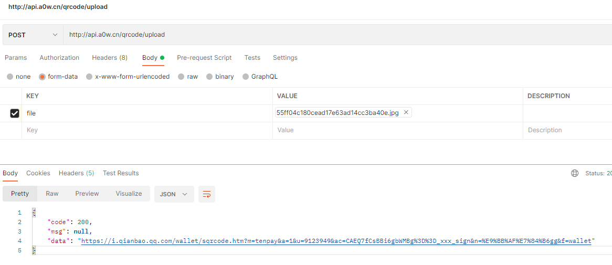
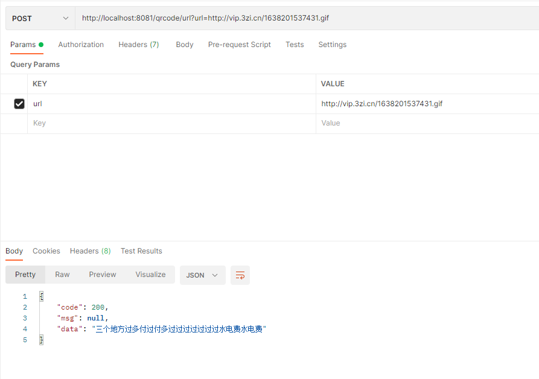

Api工具箱子
---

**1\. 上传二维码并解码**
###### 接口功能
> 上传二维码并解码

###### URL
> [http://api.a0w.cn/qrcode/upload](http://api.a0w.cn/qrcode/upload)

###### 支持格式
> png，jpg，jpeg

###### HTTP请求方式
> POST

###### 请求参数
>|参数|必选|类型|说明|
>|:-----  |:-------|:-----|----- |
>|file    |ture    |file|文件                          |

###### 返回字段
> |返回字段|字段类型|说明                              |
>|:-----   |:------|:-----------------------------   |
>|code   |int    |返回结果状态。200：正常；400：错误。   |
>|msg  |string | 错误提示                      |
>|data |object |返回数据                         |

###### 接口示例
> 地址：[http://api.a0w.cn/qrcode/upload](http://api.a0w.cn/qrcode/upload)
> 
``` 
返回：
{
    "code": 200,
    "msg": null,
    "data": "https://i.qianbao.qq.com/wallet/sqrcode.htm?m=tenpay&a=1&u=9123949&ac=CAEQ7fCsBBi6gbWMBg%3D%3D_xxx_sign&n=%E9%BB%AF%E7%84%B6gg&f=wallet"
}
```
**2\. 获取网络二维码并解码**
###### 接口功能
> 上传二维码并解码

###### URL
> [http://api.a0w.cn/qrcode/url](http://api.a0w.cn/qrcode/url)

###### 支持格式
> png，jpg，jpeg

###### HTTP请求方式
> POST

###### 请求参数
>|参数|必选|类型|说明|
>|:-----  |:-------|:-----|----- |
>|url    |ture    |string|二维码地址                          |

###### 返回字段
> |返回字段|字段类型|说明                              |
>|:-----   |:------|:-----------------------------   |
>|code   |int    |返回结果状态。200：正常；400：错误。   |
>|msg  |string | 错误提示                      |
>|data |object |返回数据                         |

###### 接口示例
> 地址：[http://api.a0w.cn/qrcode/url?url=http://vip.3zi.cn/1638201537431.gif](http://api.a0w.cn/qrcode/url?url=http://vip.3zi.cn/1638201537431.gif)
> 
``` 
返回：
{
    "code": 200,
    "msg": null,
    "data": "三个地方过多付过付多过过过过过过过水电费水电费"
}